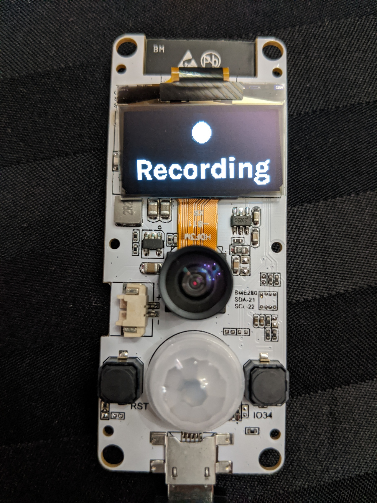
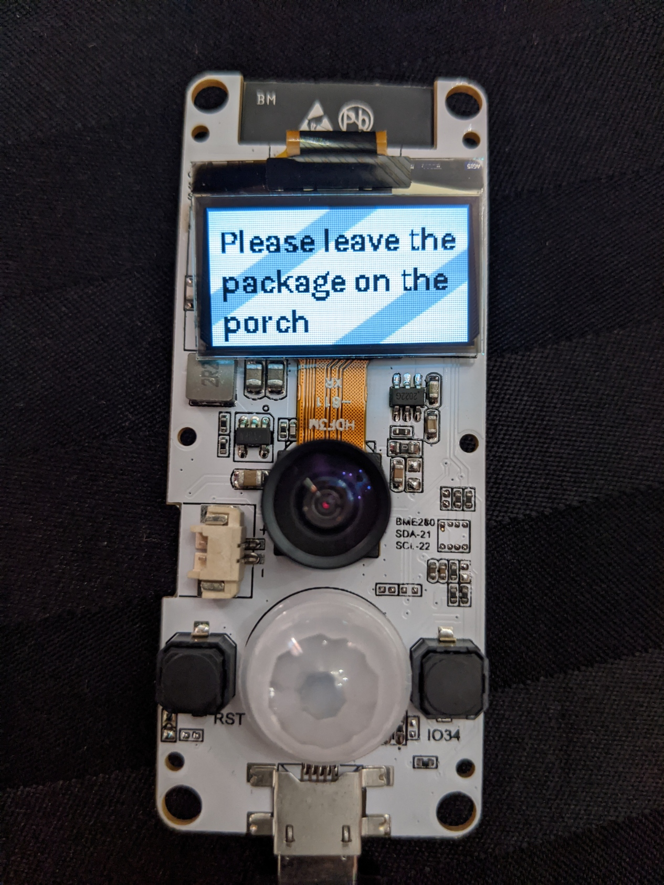

# ESP32 Doorbell Camera

This is a battery-powered motion-activated MJPEG streaming camera with auto-shutoff, MQTT, and display support implemented for TTGO T-Camera modules.




## Features

- Streams to up to 10 concurrent clients
- Battery powered, fully wireless
- Turns on when motion is detected and turns off after no motion is detected to save power
- MJPEG streaming
- Sends telemetry and receives commands over MQTT
- You can send a message to the provided display over MQTT
- Works great with Home Assistant
- Works with VLC


## Setup

Set up your Arduino IDE with these device settings:

```
  Board: AI-Thinker ESP32-CAM or ESP-EYE
  Compile as:
   ESP32 Dev Module
   CPU Freq: 240
   Flash Freq: 80
   Flash mode: QIO
   Flash Size: 4Mb
   Patrition: Minimal SPIFFS
   PSRAM: Enabled
```

Install the ArduinoMqttClient and ESP32 SSD1306 libraries

Create a `home_wifi_multi.h` file in this directory with the following format, filling in your wifi config and ip addresses:
```C++
#define SSID1 "replace with your wifi ssid"
#define PWD1 "replace your wifi password"

#define LOCAL_IP IPAddress(192, 168, 0, 3)
#define GATEWAY_IP IPAddress(192, 168, 0, 1)
#define SUBNET_MASK IPAddress(255, 255, 255, 0)
#define PRIMARY_DNS IPAddress(8, 8, 8, 8)

#define MQTT_SERVER "192.168.0.4"
```

Upload!

## Usage

Image output can be accessed over HTTP at the `/mjpeg/1` endpoint for the MJPEG stream and at the `/jpg` endpoint for still JPEG captures.

It sends out an MQTT message with content `ON` to the `camera/doorbell/available` topic when it turns on and sends `OFF` when it turns off after 30 seconds of inactivity. The device can be kept on for 30 seconds if you send a message to the `camera/doorbell/keepalive` topic while the device is on.

Messages can be displayed on the screen by sending your preferred message to the `camera/doorbell/message` MQTT topic. A blank message will clear the display.

## Based on

Based on: https://github.com/arkhipenko/esp32-cam-mjpeg-multiclient

Motion sensor, battery, and display code based on: https://github.com/lewisxhe/esp32-camera-series

Karla font from: https://github.com/google/fonts/tree/master/ofl/karla/static

Font rendered using: https://github.com/squix78/esp8266-oled-ssd1306-font-converter